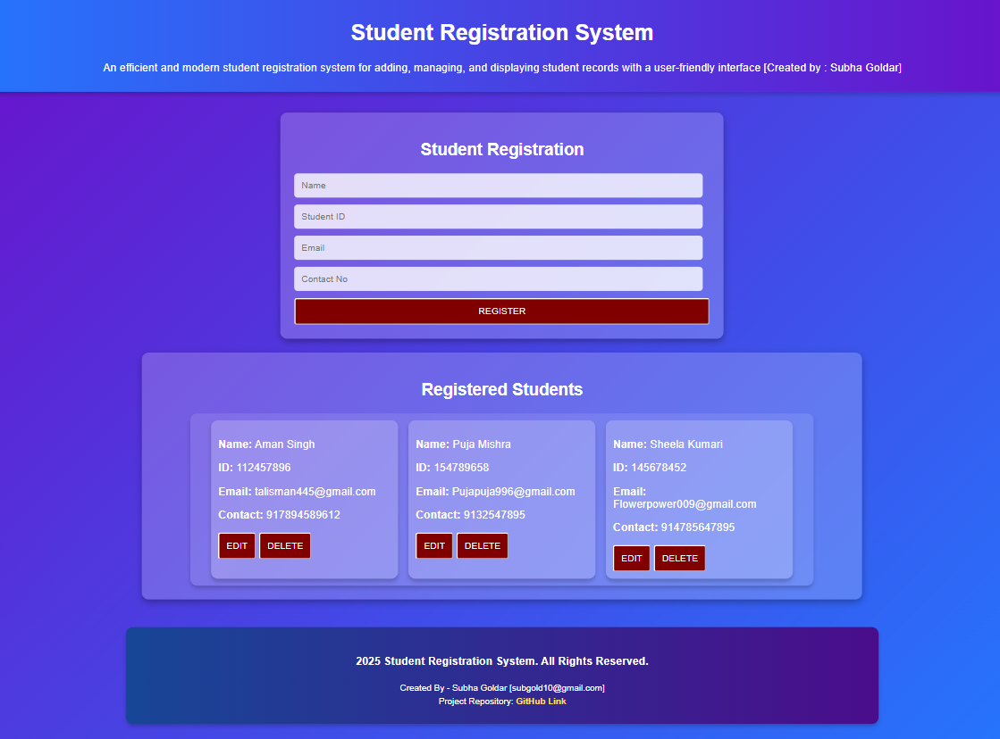
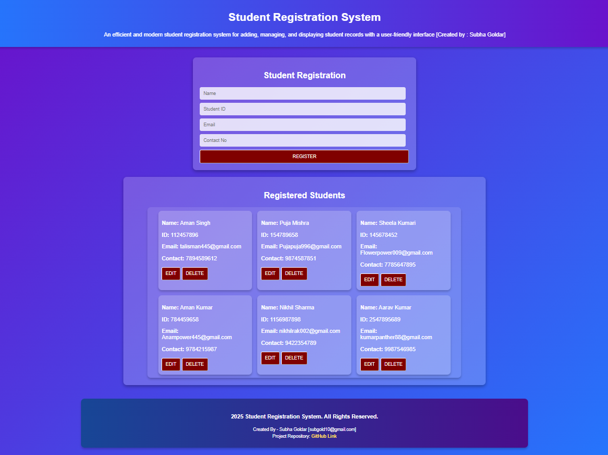
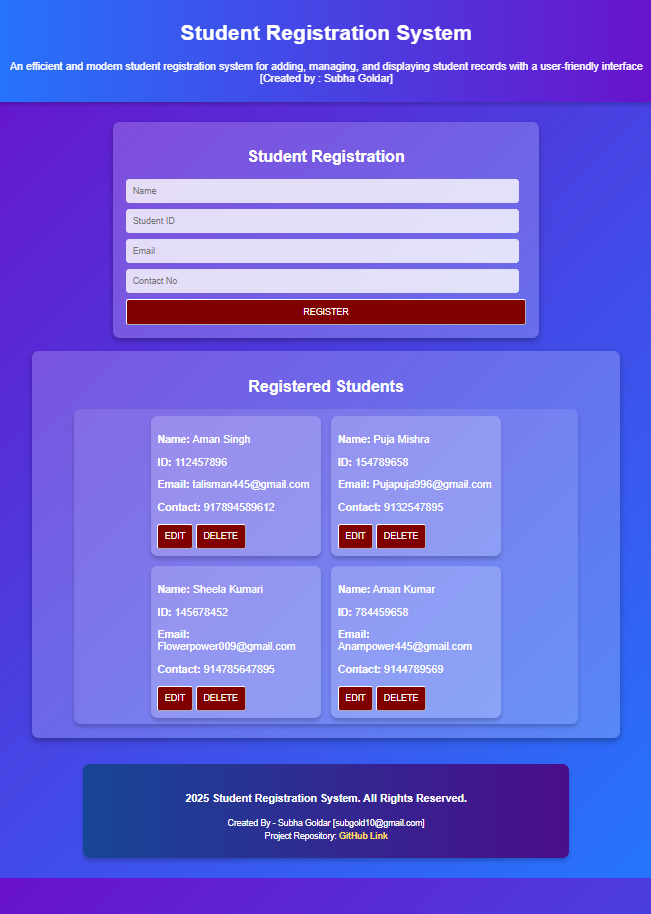

# Student Registration System ✨

✨ Author : Subha Goldar ✨

✨Email : Subgold10@gmail.com ✨

✨ A modern glassmorph style based Student Registration System ✨

The Student Registration System is a web application developed to simplify the process of managing student records. It provides an intuitive and responsive interface for adding, editing, and deleting student information, ensuring seamless record keeping and improved user interaction. The system uses modern web development technologies and techniques to create a visually appealing and functional experience.
This project is ideal for demonstrating core web development principles, responsive design, and dynamic content management. Its use of persistent storage with  ensures that data is saved across browser sessions without the need for a backend database.

## Purpose ✨

The primary goal of this project is to enable efficient student management through a straightforward and interactive interface. Whether for educational institutions or personal use, this application streamlines the process of:
- Adding new students with essential details.
- Modifying existing student records.
- Removing unnecessary entries.
- Displaying registered students in a responsive grid layout, adaptable across all devices.
- Using Local Storage to store Student Data

## Technologies Used 🛠️

- **HTML**: The main structure of the Web Page.
- **CSS**: For styling and responsiveness.
- **JavaScript**: For dynamic weather data fetching and user interactions.

## Live Demo ✨

- Link : https://subgold10.github.io/Student-Registration-System-/

## SCREENSHOTS ✨

